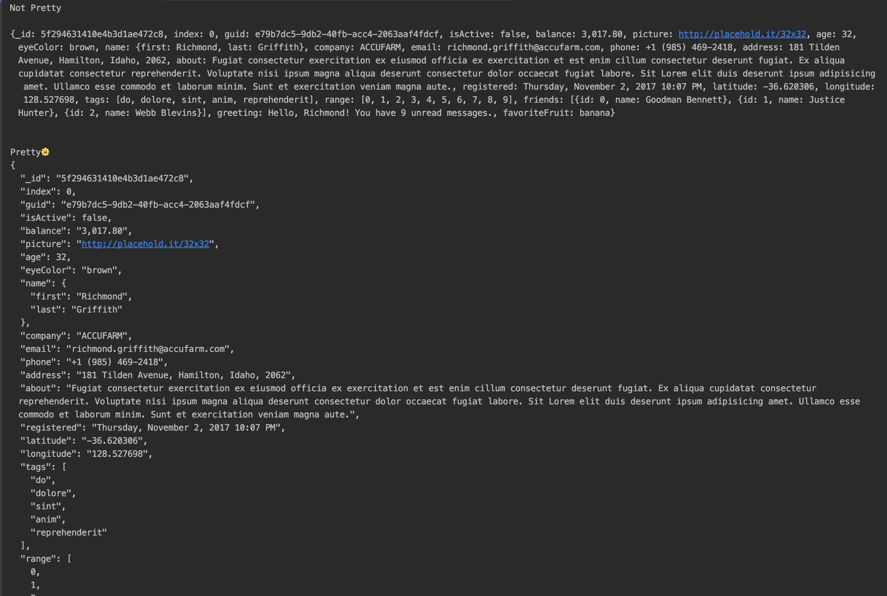

# ns_utils

🦾 tySet of methods/extensions for flutter that makes using framework in a much easier and clean way also adds additional functionality.

## Let get started

1. Go to `pubspec.yaml` 
2. add a ns_utils and replace `[version]` with the latest version:  

```yaml
dependencies:
  flutter:
    sdk: flutter
  ns_utils: ^[version]
```
3. click the packages get button or *flutter pub get*  

## Import the package

```dart
import 'package:ns_utils/src.dart';
```

## What's in the box
⚫ `BuildContext` extensions 🦾
⚫ `DateTime` extensions 🦾
⚫ `Map` extensions 🦾
⚫ `String` extensions 🦾
⚫ `double` extensions 🦾
⚫ `int` extensions 🦾
⚫ `List` extensions 🦾
⚫ `conversion` methods 🦾
⚫ `Widget` extensions 🦾
⚫ `Spacers` spacers widgets 🦾
⚫ `Sizes` (responsive app)[https://medium.com/nonstopio/let-make-responsive-app-in-flutter-e48428795476] 🦾

## BuildContext Extensions

Are you still typing `MediaQuery.of(context).size...` or `Navigator.of(this).push..` ? Let's change that 🤩

```dart
❌ Navigator.of(context).push(MaterialPageRoute(
    builder: (_) => FlutterScreen(),
  ));

✅ context.push(FlutterScreen());
```

```dart
✅ context.replace(FlutterScreen());

✅ context.makeFirst(FlutterScreen());

✅ context.pushAfterFirst(FlutterScreen());

✅ context.pop(FlutterScreen());

✅ context.popToFirst(FlutterScreen());

✅ context.maybePop(FlutterScreen());
```

```dart
❌  MediaQuery.of(context).size.width;

✅ context.mq.sizeX.width;
✅ context.mq.sizeX.height;
```

## DateTime Extensions

### .dayDifference
If value is NULL returns [Null]
Else returns the difference between current date and the object in days
excluding the the time values

### .toServerFormat()
Returns an ISO-8601 full-precision extended format representation.

### .isToday
return true if the date is today

### .isYesterday
return true if the date is Yesterday

### .isTomorrow
return true if the date is Tomorrow

### .tomorrow()
return next day

### .yesterday()

return previous day

## Map Extensions

### .getBool('key')  .getInt('key')  .getDouble('key') 
### .getString('key')  .getList('key')  .getMap('key')  
Reads a [key] value from [Map].
If value is NULL or not same type return default value [defaultValue]

```dart
    test('getBool', () {
      Map data;
      expect(data.getBool('key'), false);
      expect(data.getBool('key', defaultValue: true), true);
      data = {
        'key': true,
      };
      expect(data.getBool('key'), true);
      data = {
        'key1': true,
      };
      expect(data.getBool('key'), false);
    });
```
### .toJson()
Map to JSON using[json.encode]
```dart
    test('toJson', () {
      Map data;
      expect(data.toJson(), "{}");
      data = {
        'key': {"id": 1},
      };
      expect(data.toJson(), '{"key":{"id":1}}');
    });
```

### .toPretty()
Convert map to a String withIndent to increase readability. Thank me later 🕴️

```dart
      Map data = {
        "_id": "5f294631410e4b3d1ae472c8",
        "index": 0,
        "guid": "e79b7dc5-9db2-40fb-acc4-2063aaf4fdcf",
        "isActive": false,
        "balance": "3,017.80",
        "picture": "http://placehold.it/32x32",
        "age": 32,
        "eyeColor": "brown",
        "name": {"first": "Richmond", "last": "Griffith"},
        "company": "ACCUFARM",
        "email": "richmond.griffith@accufarm.com",
        "phone": "+1 (985) 469-2418",
        "address": "181 Tilden Avenue, Hamilton, Idaho, 2062",
        "about":
            "Fugiat consectetur exercitation ex eiusmod officia ex exercitation et est enim cillum consectetur deserunt fugiat. Ex aliqua cupidatat consectetur reprehenderit. Voluptate nisi ipsum magna aliqua deserunt consectetur dolor occaecat fugiat labore. Sit Lorem elit duis deserunt ipsum adipisicing amet. Ullamco esse commodo et laborum minim. Sunt et exercitation veniam magna aute.",
        "registered": "Thursday, November 2, 2017 10:07 PM",
        "latitude": "-36.620306",
        "longitude": "128.527698",
        "tags": ["do", "dolore", "sint", "anim", "reprehenderit"],
        "range": [0, 1, 2, 3, 4, 5, 6, 7, 8, 9],
        "friends": [
          {"id": 0, "name": "Goodman Bennett"},
          {"id": 1, "name": "Justice Hunter"},
          {"id": 2, "name": "Webb Blevins"}
        ],
        "greeting": "Hello, Richmond! You have 9 unread messages.",
        "favoriteFruit": "banana"
      };

      debugPrint('Not Pretty\n');
      debugPrint('$data');
      debugPrint('\n\nPretty🌼');
      debugPrint(data.toPretty());
```


## List Extensions

### .toJson()
Map to JSON using[json.encode]
```dart
    test('toJson', () {
      expect([12, 12].toJson(), '[12,12]');
      expect([].toJson(), '[]');
      expect(['123', '1234'].toJson(), '["123","1234"]');
      List list;
      expect(list.toJson(), '[]');
    });
```

## String Extensions

### .toMap()
JSON String to Map using[json.decode]

```dart
    test('toMap', () {
      expect(''.toMap(), {});
      expect('{"id":1}'.toMap(), {"id": 1});
      expect('{"id":"123"}'.toMap(), {"id": "123"});
    });
```

### .toList()
JSON String to List using[json.decode]

```dart
    test('toList', () {
      expect(''.toList(), []);
      expect('[1,2,3]'.toList(), [1, 2, 3]);
      expect('["1","2"]'.toList(), ["1", "2"]);
    });
```

### .isEmptyOrNull
Return a bool if the string is null or empty

```dart
    test('isEmptyOrNull', () {
      expect(''.isEmptyOrNull, true);
      expect('Ajay'.isEmptyOrNull, false);
      String value;
      expect(value.isEmptyOrNull, true);
    });
```

### .isNotBlank
Returns true if s is neither null, empty nor is solely made of whitespace characters.

```dart
    test('isNotBlank', () {
      expect(''.isNotBlank, false);
      expect('Ajay'.isNotBlank, true);
      String value;
      expect(value.isNotBlank, false);
    });
```

### .toINT && .toDOUBLE
Parses the string as an int/double or 0.

```dart
    test('toINT', () {
      expect('12121'.toINT, 12121);
      expect('12.121'.toINT, 12);
      expect('12.1.21'.toINT, 0);
    });
    test('toDOUBLE', () {
      expect('12121'.toDOUBLE, 12121);
      expect('12.121'.toDOUBLE, 12.121);
      expect('12.1.21'.toDOUBLE, 0);
    });
```

### .asBool
Convert this string into boolean.
Returns `true` if this string is any of these
values: `"true"`, `"yes"`, `"1"`,
or if the string is a number and greater than 0, `false`
if less than 1. This is also case insensitive.

```dart
    test('asBool', () {
      expect('true'.asBool, true);
      expect('True'.asBool, true);
      expect('false'.asBool, false);
      expect('False'.asBool, false);
      expect('yes'.asBool, true);
      expect('YES'.asBool, true);
      expect('no'.asBool, false);
      expect('NO'.asBool, false);
      // string numbers
      expect('232'.asBool, true);
      expect('1'.asBool, true);
      expect('0'.asBool, false);
      expect('-1'.asBool, false);
    });
```

### .toDateTime()
 Parse string to [DateTime] or [Null]
 
```dart
    test('toDateTime', () {
      expect('2020-08-01'.toDateTime(), DateTime(2020, 08, 01));
      String value = DateTime(2020, 08, 01).toIso8601String();
      expect(value.toDateTime(), DateTime(2020, 08, 01));
    });
```

## double/int Extensions

### .asBool
Convert this integer into boolean.
Returns `true` if this integer is greater than *0*.

```dart
    test('asBool', () {
      expect(1.asBool, true);
      expect(0.asBool, false);
      expect(9382.asBool, true);
      expect((-2272).asBool, false);
    });
```

### .tenth
Returns tenth of the number

### .fourth
Returns fourth of the number

### .half
Returns third of the number

### .half
Returns third of the number

### .doubled
Returns doubled of the number

### .tripled
Returns tripled of the number

## Widget Extensions & Spacers
So now you can just add tootips and added gestures to our `Widgets` without the crazy water-fall effect. awesome!
That's just the tip of the iceberg, expect to see very cool stuff soon.
```dart

❌  Tooltip(
    message: 'NS Utils Text',
    child: GestureDetector(
      onLongPress: () => print('onLongPress'),
      onTap: () => print('onTap'),
      child: Container(
        height: 100,
        width: 100,
        child: Text('NS Utils are Awesome'),),
    ),
  ),


✅ Container(height: 100, width: 100,child: Text('NS Utils are Awesome'),)
     .withTooltip('NS Utils Text')
     .onLongPress(() => print('onLongPress'))
     .onTap(() => print('onTap')),
```

```dart

❌ SizedBox(
   height: 10,
   width: 10,
   )
OR
❌ Container(
   height: 10,
   width: 10,
   )            

✅ C10()

```

## Sizes - Responsive App in Flutter

[Demo](https://miro.medium.com/max/2160/1*zNcRtlhzm9407KJWtAFnFw.png)

Read [this](https://medium.com/nonstopio/let-make-responsive-app-in-flutter-e48428795476) story for detailed explanation.

## Contributing

If you have read up till here, then 🎉🎉🎉. There are couple of ways in which you can contribute to
the growing community of `ns_utils.dart`.


- Propose any feature, enhancement
- Report a bug
- Fix a bug
- Participate in a discussion and help in decision making
- Write and improve some **documentation**. Documentation is super critical and its importance
  cannot be overstated!
- Send in a Pull Request :-)